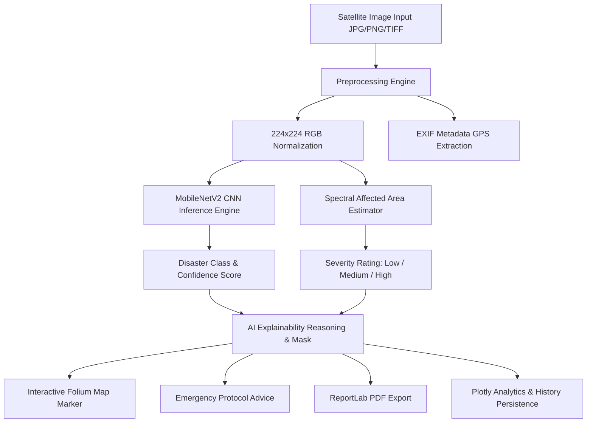

# OrbitEye 🌍
### AI-Powered Earth Observation & Disaster Intelligence Platform

OrbitEye is a modern, deep-learning-powered satellite intelligence platform designed to perform automated multi-hazard disaster classification, pixel-level affected area estimation, AI explainability reasoning, bi-temporal before/after change detection, interactive spatial mapping, and automated PDF report generation.

---

## 🌟 Key Features

- **MobileNetV2 Transfer Learning**: Optimized deep neural network pre-trained on ImageNet and fine-tuned on multi-class satellite imagery (`Wildfire`, `Flood`, `Deforestation`, `Urban Expansion`, `Normal`).
- **Affected Area Estimation Engine**: Spectral mask segmentation computing exact affected pixel percentage with rule-based severity rating:
  - `< 20%` → **Low Severity** 🟢
  - `20% – 50%` → **Medium Severity** 🟡
  - `> 50%` → **High Severity** 🔴
- **Bi-Temporal Before/After Change Detection**: Pixel-difference engine comparing baseline (Image A) vs post-event (Image B) satellite captures to calculate vegetation loss, flood expansion, or urban growth percentages.
- **AI Explainability Module**: Spectral feature visualization and rule-based explanations describing why the model made its prediction (e.g. blue water spread, thermal/red intensity, green canopy reduction, gray concrete grid signatures).
- **Interactive Spatial Mapping**: Embeds Folium satellite maps with auto-extracted EXIF GPS coordinates or hotspot fallback markers.
- **PDF Report Generation**: Instant exportable executive disaster summaries via ReportLab.
- **Analytics Dashboard & Persistent History**: Plotly KPI tracking total images analyzed, disaster frequency distribution, average processing time, and average affected area.
- **Educational Learning Hub**: Interactive knowledge cards detailing NDVI, Remote Sensing, Optical vs SAR Satellite Imaging, and Disaster Mechanisms.

---

## 🏗 System Architecture



---

## 🔄 Execution Workflow

1. **Upload & Preprocess**: User drops satellite imagery or selects "Try Sample Images". Preprocessor resizes image to 224x224 and normalizes pixel tensors.
2. **Transfer Learning Inference**: MobileNetV2 outputs prediction probability across 5 target disaster classes.
3. **Spectral Severity Calculation**: Color segmentation computes mask percentage to assign Affected Area rating (<20%, 20–50%, >50%).
4. **Bi-Temporal Analysis (Optional)**: Dual image upload computes pixel deltas between baseline and current captures.
5. **Actionable Intelligence**: Displays Folium map marker, emergency actions, explainability card, and downloadable PDF report.

---

## 📊 Dataset Reference

OrbitEye V1 utilizes open-access satellite imagery derived from public benchmark datasets:
- **EuroSAT / Sentinel-2**: Multi-spectral Sentinel-2 satellite imagery curated by DFKI (German Research Center for Artificial Intelligence) covering land-use categories including forests, rivers, industrial areas, and fire scars.
- **UC Merced / AID**: Public aerial and satellite land-use benchmark datasets for urban structures, floodplains, and dense forest canopy.

> *Note: PlanetScope data references have been removed to comply with open-data licensing.*

---

## 🚀 Installation & Setup

### Prerequisites
- Python 3.9 – 3.11
- `pip` or `uv` package manager

### Installation Steps

1. **Clone or Navigate to the Workspace**:
   ```bash
   cd "C:\Users\AKSHAYA SADASIVAN\OrbitEye"
   ```

2. **Create and Activate Virtual Environment**:
   ```bash
   python -m venv venv
   # On Windows PowerShell:
   .\venv\Scripts\Activate.ps1
   ```

3. **Install Dependencies**:
   ```bash
   pip install -r requirements.txt
   ```

4. **Train / Initialize Model**:
   ```bash
   python model/train_mobilenet.py
   ```

5. **Launch OrbitEye**:
   ```bash
   streamlit run app.py
   ```

---

## 🗺 Platform Roadmap

### 🟢 Version 1.0 (Current Release)
- [x] MobileNetV2 transfer learning engine
- [x] Affected Area Estimation engine (<20%, 20-50%, >50%)
- [x] Bi-temporal change detection
- [x] AI Explainability rules & segmentation masks
- [x] Interactive Folium maps & PDF reports
- [x] Plotly dashboard & persistent analysis history

### 🟡 Version 2.0 (Planned)
- [ ] Multispectral GeoTIFF band math (NDVI, NDWI, NBR computation)
- [ ] YOLOv8 object detection for vehicle and building damage counts
- [ ] Real-time Sentinel-Hub API integration for live satellite querying

### 🔴 Version 3.0 (Future Vision)
- [ ] Autonomous satellite swarm alert triggers via Webhooks
- [ ] Automated 3D elevation point cloud generation (LiDAR/Stereo SAR)
- [ ] Multi-tenant emergency response team dispatch dashboard

---

## 📄 License

Distributed under the MIT License. See `LICENSE` for more information.
